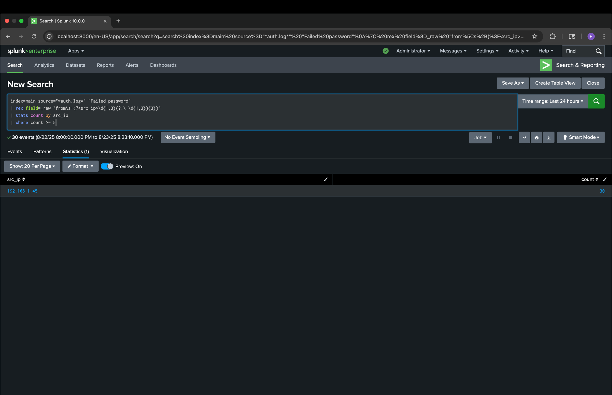
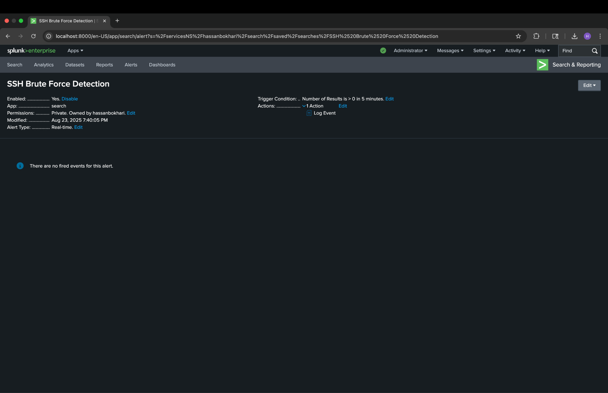

# SIEM-Lab-Splunk
SSH Brute Force Detection with Splunk

## Overview
This project simulates and detects **SSH brute force attacks** using Splunk Enterprise.  
The goal was to build a mini **Security Information & Event Management (SIEM) lab** and showcase how to:  
- Ingest log data (auth.log)  
- Write custom detection queries in SPL  
- Create real-time alerts for suspicious activity  

---

## Tools & Technologies
- **Splunk Enterprise (Free Tier)** – SIEM platform  
- **macOS Terminal** – log generation script  
- **Auth.log simulation** – fake SSH login attempts  

---

## Steps
1. **Created simulated logs** with repeated “Failed password” entries using a Bash script.  
2. **Ingested logs into Splunk** using the `Add Data` feature.  
3. **Wrote SPL query** to detect brute force attempts:  
   ```spl
   index=main source="*auth.log*" "Failed password"
   | rex field=_raw "from\s+(?<src_ip>\d{1,3}(?:\.\d{1,3}){3})"
   | stats count by src_ip
   | where count >= 5
4. Set up a real-time alert (“SSH Brute Force Detection”) to trigger when >=5 failed logins occur from the same IP.

What I Learned

How to simulate real world log data for SIEM testing

Writing SPL queries to detect suspicious patterns

Setting up Splunk alerts for proactive monitoring

Structuring a repeatable detection lab for portfolio use

##  Results

Detection of brute force attempts in Splunk:



Real-time alert setup:


